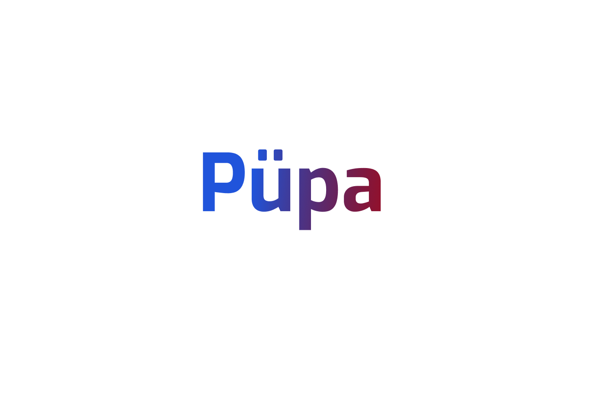



# Техническое задание

# 1. Цель проекта
# 1. Projekti eesmärk

Цель проекта - разработать веб-приложение (веб-сайт), с помощью которого пользователи смогут создавать различные игры/задания (далее карты) для. Пользователю, создающему карты (далее учитель), будет доступно несколько макетов карт, по типу “выбери верный вариант ответа” или “соедени пары”, в которые он сможет добавлять условие задания и варианты ответов, отмечать правильные/неправильные варианты. Карты в свою очередь, можно добавлять в наборы, чтобы была возможность для долгих сессий выполнения карт без постоянного переключения. Для пользователя, который выполняет карты (далее ученик), в конце выполнения задания будет выводиться его персональный результат: процент прохождения и скорость решения. Помимо создания простых карт должна быть возможность автоматического создания кроссвордов, при котором от учителя требуется лишь добавить нужные слова, а сам кроссворд составится автоматически. 

Projekti eesmärk - veebirakenduse(veebisaiti) arendamine, mille abil kasutajat saavad luua kõiksuguseid mänge/ülesanndeid(edaspidi kaardid). Kasutajale, kes loob kaarte(edaspidi õpetaja) on saadaval mitu kaardi maketti, näiteks "vali õige vastus" või "leia paari", kuhu ta ise saab lisada ülesannete tingumusi ja vastuste võimalusi, märkida õiget/valet varianti. Kaadrid, omakorda, saab lisada komplektidesse, et pleks võimalus pikkemateks sessioonideks ilma pideva ringiliikumise. Kasutajale, kes lahendab kaarte(edaspidi õpilane), peale harjutuste lõppetamist väljundatakse tema isiklik tulemus: läbimise protsent ja lahendamise kiirus. Samas peab olema ka automaatne ristsõna loomise võimalus, kus õpetajalt nõudakse ainult vajaliku sõna lisamist, ristsõna ise luuakse automaatselt.

# 2. Описание приложения
# 2. Projekti kirjeldus

Приложение состоит из следующих функциональных блоков:

1. Регистрация, аутентификация и авторизация
2. Функционал для учителя
3. Функционал для ученика

Rakendus koosneb järgmistest blokkidest:

1. Registreerimine, autentimine ja sisselogimine
2. Õpetaja funktsionaalsus
3. Õpilase funktsionaalsus

## 2.1 Типы пользователей
## 2.1 Kasutajate tüübid

В приложении предусмотрены два типа пользователей: учитель и ученик. Учитель создает карты, может делать их открытыми/закрытыми, то же самое с наборами карт, просматривает решения учеников. Ученик выбирает доступные ему карты, решает их, может просматривать свой результат, персональную статистику.  

Rakenduses on ettenähtud kaks tüüpi kasutajaid: õpetaja ja õpilane. Õpetaja loob kaarte, saab neid teha avatuks/suletuks, samamoodi ka pakkidega, läbivaadata õpilase lahendusi. Õpilane valib kaarte, mis on talle saadavad, lahendab neid, saab oma tulemust ja isiklikut statistikat vaadata.

## 2.2 Регистрация
## 2.2 Registreerimine

Для регистрации пользователю нужно указать:

1. Имя и фамилию 
2. email
3. Пароль

Registreerimiseks kasutaja peab sisestama:

1. Nimi ja perekonnanimi
2. email
3. Salasõna

## 2.3 Аутентификация учителя и ученика
## 2.3 Õpetaja ja õpilase sisselogimine

В первоначальной версии приложения, сразу после аутентификации у пользователя будет запрошена роль: учитель или ученик. На основе его выбора, приложение будет показывать ему функционал, привязанный к выбранной роли.
Для пользователя должна быть реализована возможность восстановления забытого пароля. При запросе восстановления пароля необходимо на email пользователя прислать ссылку на восстановление пароля.  

Esialgses rakenduse versioonis, kohe peale sisselogimist kasutajalt küsitakse tema roll: õpetaja või õpilane. Funktsionaalsus, mida talle pakkutakse, on seotud rolliga, mida ta valib. 
Kasutajal peab olema realiseeritud unustatud salasõna taastamise võimalus. Salasõna taastamise nõudmisel on vajalik saata email´i peale link, mille abil saab salasõna taastada.

## 2.4 Функционал для учителя
## 2.4 Õpetaja funktsionaalsus

Учитель после аутентификации и выбора роли “Учитель” получает доступ к такому функционалу:

1. Создание карт, их наборов
2. Просмотр созданных/общедоступных карт, наборов карт
3. Редактирование готовых заданий: изменение содержимого, перенос из одной папки в другую, изменение статуса (открытое/закрытое)
4. Просмотр статистики учеников по прохождению созданных заданий
5. Распечатывание заданий, которые имеют тип “кроссворд”
6. Распечатывание карточек, для дальнейшего использования на уроках в живую

Peale sisselogimist ja rolli valimist "Õpetaja" saab läbipääsu järgmisele funktsionaalile:

1. Kaardide ja kaardi pakkide loomine
2. Loodud/avaliku kaarte ja pakkide läbivaatamine
3. Valmistatud harjutuste redakteerimine: sisu muutumine, ühest pakkist teisse ülekandmine, staatuse muutmine(avalik/suletud)
4. Loodud ülesannete lahendamine statistika ülevaade
5. Harjutuste väljaprintimine, millel on tüüp "ristsõna"
6. Kaardide väljaprintimine, selleks, et kasutada neid kontakttunnis

> по каждому пункту можно расписать подробнее

## 2.5 Функционал для ученика
## 2.5 Õpilase funktsionaalsus

Ученик после аутентификации и выбора роли “Ученик” получает доступ к такому функционалу:

1. Просмотр доступных, пройденных наборов карт
2. Просмотр информации о наборах карт
3. Выполнение заданий
4. Просмотр собственной статистики выполнения заданий

Peale sisselogimist ja rolli valimist "Õpilane" saab läbipääsu järgmisele funktsionaalile:

1. Ülevaade kaardidest, mis on saadaval
2. Pakkide infost ülevaade
3. Ülesannete lahendamine
4. Oma lahendatud ülesannetest statistika ülevaade

# Похожие приложения 

https://www.flexiquiz.com/
